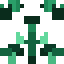
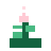
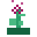
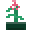

# Need icon previews

Each preview uses the live SVG silhouette generated for the corresponding need.

| Need | Preview |
| --- | --- |
| Autonomy |  |
| Belonging |  |
| Safety |  |
| Relaxation |  |
| Fairness |  |
| Growth |  |
| Inclusion |  |
| Clarity |  |

